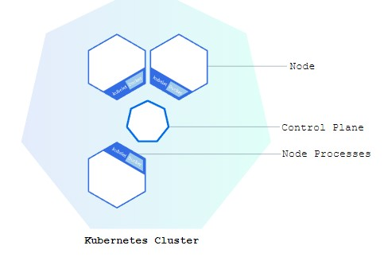

# kubernetes

## What is Kubernetes?
---
This page is an overview of Kubernetes.

Kubernetes is a portable, extensible, open source platform for managing containerized workloads and services, that facilitates both declarative configuration and automation. It has a large, rapidly growing ecosystem. Kubernetes services, support, and tools are widely available.

## Fun fuct
---
The name Kubernetes originates from Greek, meaning helmsman or pilot. K8s as an abbreviation results from counting the eight letters between the "K" and the "s". Google open-sourced the Kubernetes project in 2014. Kubernetes combines over 15 years of Google's experience running production workloads at scale with best-of-breed ideas and practices from the community.

## What can Kubernetes do?
---

- Service discovery and load balancing

 Kubernetes can expose a container using the DNS name or using their own IP address. If traffic to a container is high, Kubernetes is able to load balance and distribute the network traffic so that the deployment is stable.

- Storage orchestration

Kubernetes allows you to automatically mount a storage system of your choice, such as local storages, public cloud providers, and more.

- Automated rollouts and rollbacks

You can describe the desired state for your deployed containers using Kubernetes, and it can change the actual state to the desired state at a controlled rate. For example, you can automate Kubernetes to create new containers for your deployment, remove existing containers and adopt all their resources to the new container.

- Automatic bin packing

You provide Kubernetes with a cluster of nodes that it can use to run containerized tasks. You tell Kubernetes how much CPU and memory (RAM) each container needs. Kubernetes can fit containers onto your nodes to make the best use of your resources.

- Self-healing

Kubernetes restarts containers that fail, replaces containers, kills containers that don't respond to your user-defined health check, and doesn't advertise them to clients until they are ready to serve.

- Secret and configuration management

Kubernetes lets you store and manage sensitive information, such as passwords, OAuth tokens, and SSH keys. You can deploy and update secrets and application configuration without rebuilding your container images, and without exposing secrets in your stack configuration.

## What is k8 objects
--- 

## k8 services

## k8 connects to micro-services
Using selectors and labels

## What is a Kubernetes cluster

Kubernetes coordinates a highly available cluster of computers that are connected to work as a single unit. The abstractions in Kubernetes allow you to deploy containerized applications to a cluster without tying them specifically to individual machines. To make use of this new model of deployment, applications need to be packaged in a way that decouples them from individual hosts: they need to be containerized. Containerized applications are more flexible and available than in past deployment models, where applications were installed directly onto specific machines as packages deeply integrated into the host. Kubernetes automates the distribution and scheduling of application containers across a cluster in a more efficient way. Kubernetes is an open-source platform and is production-ready.

A Kubernetes cluster consists of two types of resources:

The Control Plane coordinates the cluster
Nodes are the workers that run applications

## Cluster Diagram

