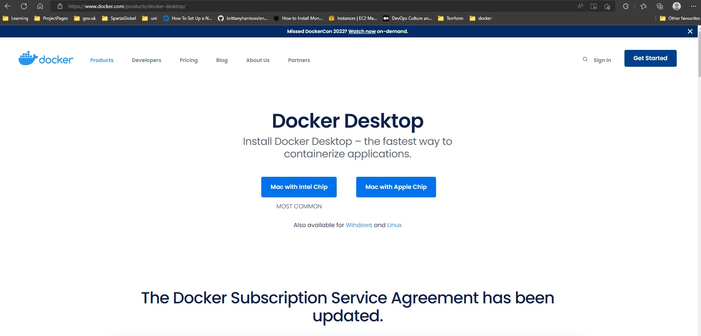
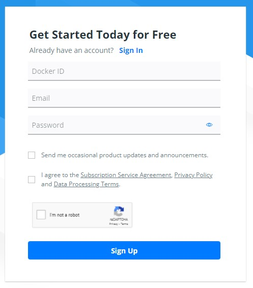
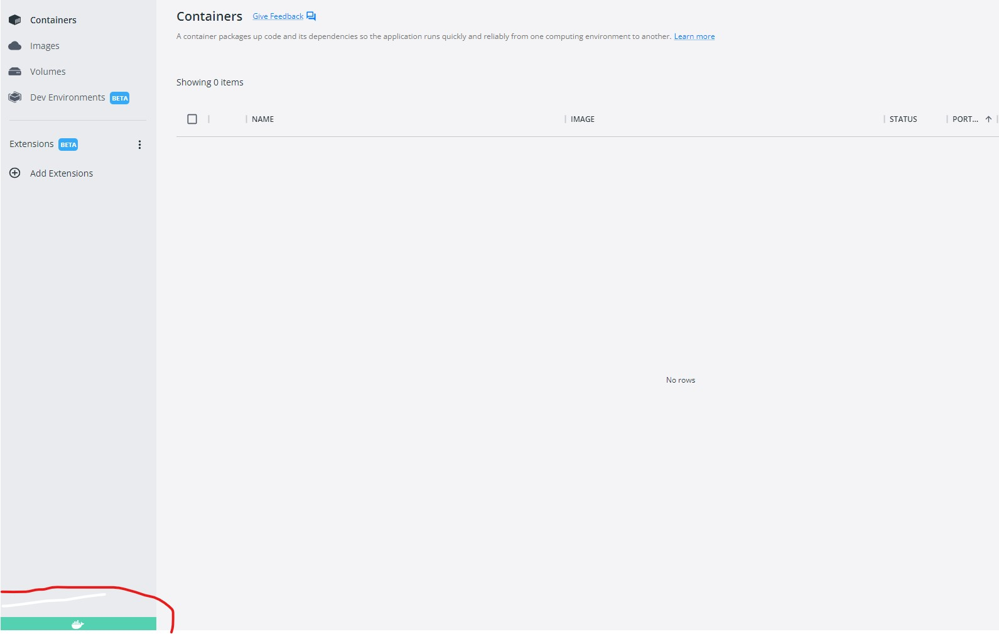
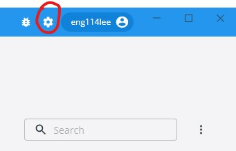
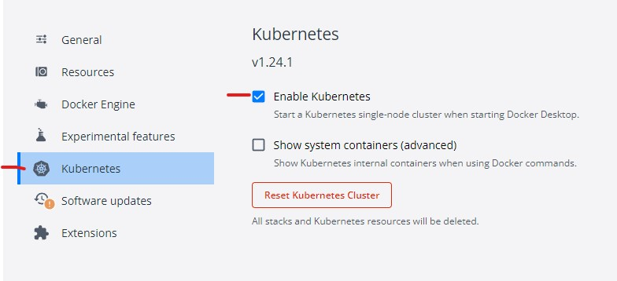
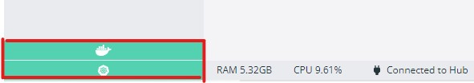
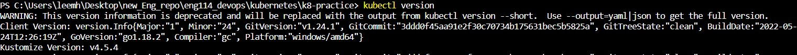
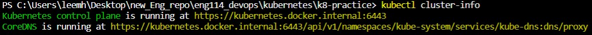
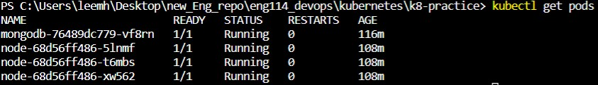

# How to make an app and Database using Kubernetes

- Kubernetes AKA k8s 

# Kubernetes set-up
---

### 1. Download "docker desktop"  
---

https://www.docker.com/products/docker-desktop/

### 2. Register with Docker
---

### 3. Sign in to docker desktop
---
You can see if docker is running and connected, by seeing the green icon in the bottom left corner. as shown below:

Any Docker containers you have previously created will be shown here. 

### 4. Navigate to settings
---
To install K8s click on settings icon in top left corner/

### 5. Select "Kubernetes" tabs and "enable Kubernetes" check box, as shown below:
---

### 6. On the Docker main screen, In the bottom left corner, you will now see two green icons
---
 - One for Docker online
 - The other for Kubenetes online
As shown below. 

- We are now ready to use Kubernetes..

## Setting up the app

### Check Kubernetes version
---
- Run `kubeetl version` to check version

### Create a deploy yml file for app
---
k8 is a yml file

we are going to create a deployment for our node-image

we will create 3 pods with with deployment`
kubenetes get name-services - deploy/deployment

`apiVersion: apps/v1 # We uses APIs to communicate between app and db
kind: Deployment`

keep all names the same where every they are for the app

metadata:
  name: node
spec:
  selector:
    matchLabels:
      app: node
  replicas: 3
  template:
    metadata:
      labels:
        app: node
    spec:
      containers:
        - name: node
          image: eng114lee/node:v1
          env:
          - name: DB_HOST
            value: mongodb://10.99.245.53:27017/posts

          ports:
            - containerPort: 3000

          imagePullPolicy: Always
`
### info for k8s cluster
- Run `kubectl get svc`, this will show any clusters the system has.

- Run `kubectl cluster-info` will give you details about current Kubernetes control plane.

### info for k8 pods

- Run `kubectl get pod`

