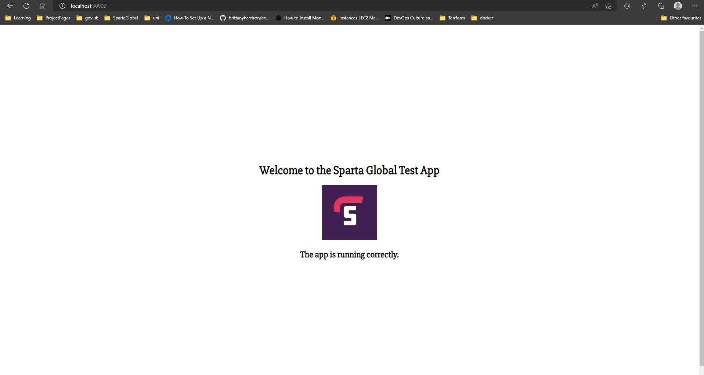
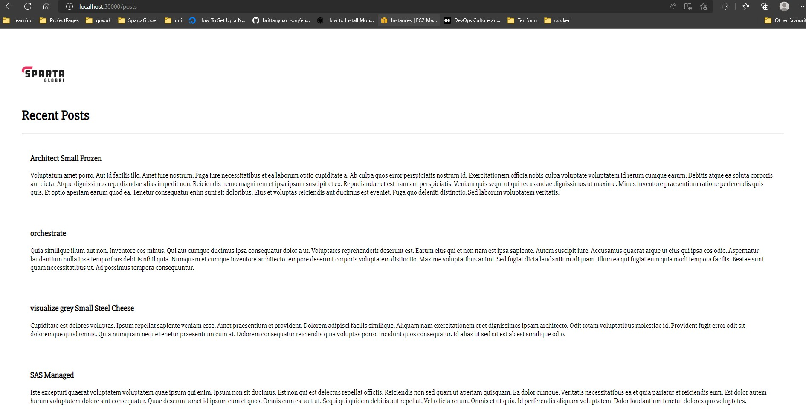

# How to make an app and Database using Kubernetes

- Kubernetes AKA k8s 

# Kubernetes set-up
---


### 1. Download "docker desktop"  
---


https://www.docker.com/products/docker-desktop/

### 2. Register with Docker
---


### 3. Sign in to docker desktop
---
You can see if docker is running and connected, by seeing the green icon in the bottom left corner. as shown below:

Any Docker containers you have previously created will be shown here. 


### 4. Navigate to settings
---
To install K8s click on settings icon in top left corner/


### 5. Select "Kubernetes" tabs and "enable Kubernetes" check box, as shown below:
---


### 6. On the Docker main screen, In the bottom left corner, you will now see two green icons
---
 - One for Docker online
 - The other for Kubenetes online
As shown below. 


- We are now ready to use Kubernetes..

## Setting up the app

### Check Kubernetes version
---
- Run `kubeetl version` to check version


### Create a deploy-node.yml file for app
---
```
# k8 is a yml file
# we are going to create a deployment for our node-image
# we will create 3 pods with with deployment`
kubenetes get name-services - deploy/deployment

apiVersion: apps/v1 # We uses APIs to communicate between app and db
kind: Deployment

# keep all names the same where every they are for the app"

metadata:
  name: node
spec:
  selector:
    matchLabels:
      app: node
  replicas: 3
  template:
    metadata:
      labels:
        app: node
    spec:
      containers:
        - name: node
          image: eng114lee/node:v1
          env:
          - name: DB_HOST
            value: mongodb://[db_ip]:27017/posts

          ports:
            - containerPort: 3000


          imagePullPolicy: Always
```

## Create svc-node.yml file for app
```
apiVersion: v1
kind: Service
metadata:
  name: node
  namespace: default
spec:
  ports:
  - nodePort: 30000 # 302222
    port: 3000
    protocol: TCP
    targetPort: 3000

    
  selector:
      app: node
  type: NodePort # cluster - loadbalancer

# 3 types of svc - cluster-ip - NodePort - Loadbalancer 

```

## Now do the same for your mongodb

### First the mongodb-deploy.yml file
---
 ```
 # k8 is a yml file
# we are going to create a deployment for our mongodb-image
# we will create 3 pods with with deployment
# kubenetes get name-services - deploy/deployment
apiVersion: apps/v1

kind: Deployment

metadata:
  name: mongodb
spec:
  selector:
    matchLabels:
      app: mongodb
  replicas: 1
  template:
    metadata:
      labels:
        app: mongodb
    spec:
      containers:
        - name: mongodb
          image: eng114lee/mongo_production:db
          #env:
          # - name: DB_HOST
          #  value: mongodb://10.99.245.53:27017

          ports:
            - containerPort: 27017
          

          imagePullPolicy: Always
```

## Them the svc-mongo.yml file
---
```
apiVersion: v1
kind: Service
metadata:
  name: mongodb
  namespace: default
spec:
  ports:
    - port: 27017
      protocol: TCP
      targetPort: 27017


  selector:
    app: mongodb
  #type: NodePort
```

## Now create them using

### Create node and mongodb deployment run:
---
- For node run `kubectl create -f node-deploy.yml`
- For mongo run `kubectl create -f mongo-deploy.yml`

### Create node and mongodb services run:
---
- For node services `kubectl create -f svc-node.yml`
- For mongodb services `kubectl create -f svc-mongo.yml`

### ensure k8s cluster running with these commands
---

- Run `kubectl get svc`, this will show any clusters the system has.

- Run `kubectl cluster-info` will give you details about current Kubernetes control plane.


### info for k8 pods

- Run `kubectl get pod`


## To see results in browser
---
- using the "NodePort" you entered in svc-node.yml file. go to your browser, in the url enter "localhost:[NodePort-Number]" and press enter.

- You will see your webpage:



- To see mongodb working, go to url and enter "localhost:[NodePort-Number]/posts"

- You will see your mongodb running:



### Possible blockers
---
- Did your app `npm start`?
- Did you seed your database in the app instance?
- Do you have the corrent ip in the enviroment variable?
